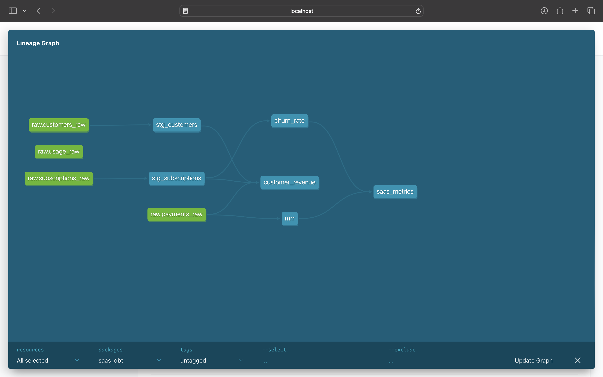
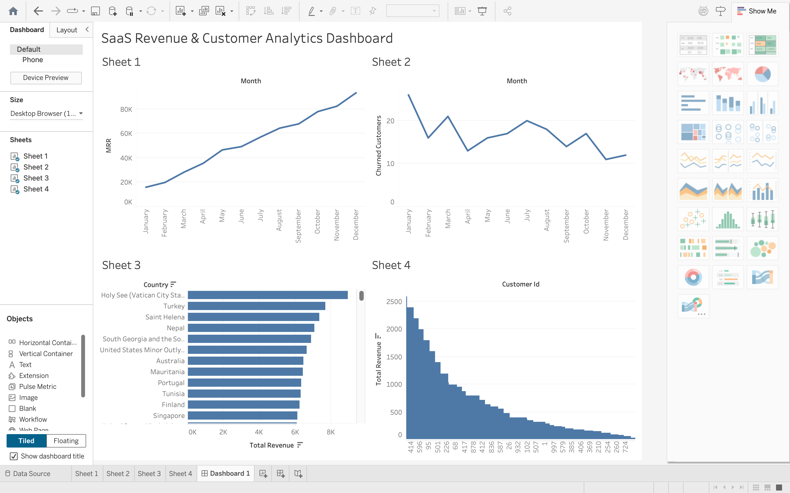
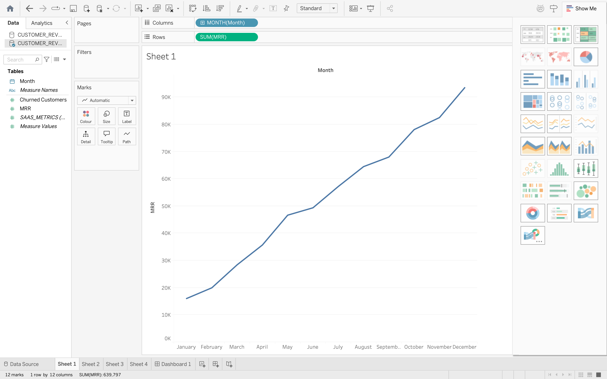
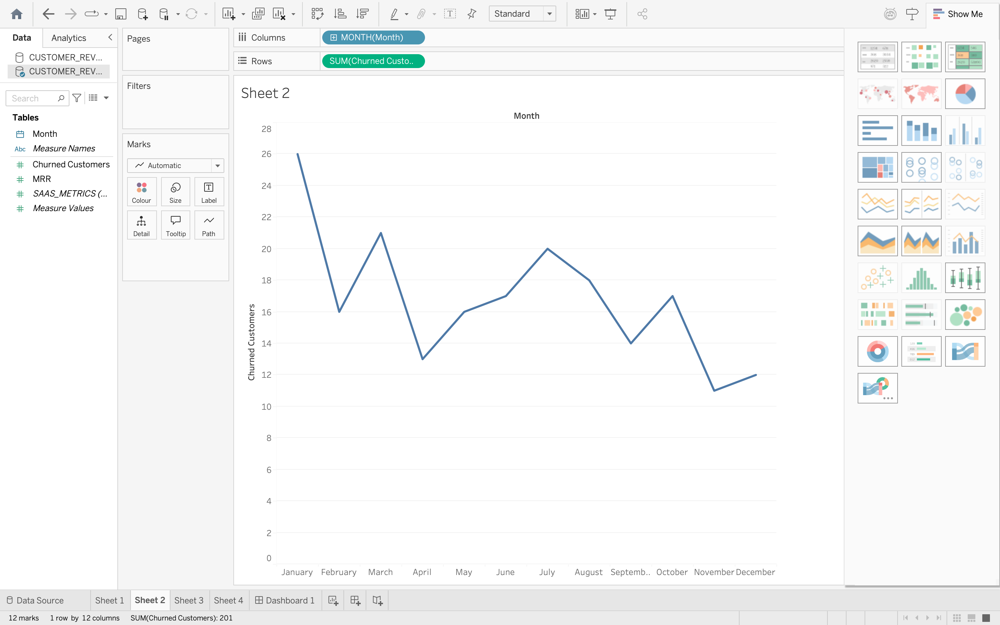
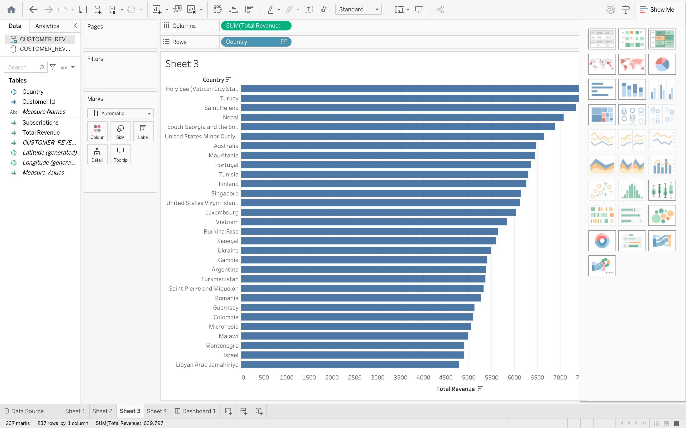
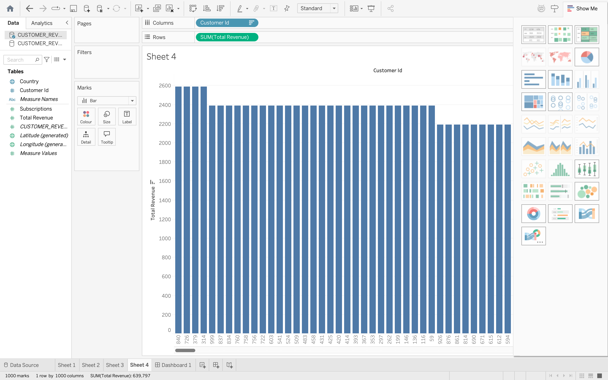

# SaaS Analytics Pipeline

## Overview

This project is an end-to-end data analytics pipeline that simulates a SaaS business.

It generates synthetic data, stores it in Snowflake, transforms it using dbt, and visualises key business metrics in Tableau.

---

## Tech Stack

- Python (data generation)
- Snowflake (data warehouse)
- dbt (data transformation)
- Tableau (data visualisation)

---

## Data Pipeline

Python → Snowflake → dbt → Tableau

---

## Key Metrics

- Monthly Recurring Revenue (MRR)
- Customer Churn
- Revenue by Country
- Customer Revenue

---

## Project Structure
```
Python (Synthetic Data Generation)
        │
        ▼
CSV Data Sources
        │
        ▼
Snowflake (Data Warehouse - RAW Layer)
        │
        ▼
dbt Staging Layer (Data Cleaning & Transformation)
        │
        ▼
dbt Marts Layer (Business Metrics & Aggregations)
        │
        ▼
Analytics Layer (MRR, Churn, Revenue)
        │
        ▼
Tableau (Data Visualisation Dashboard)
```
---

## Dashboard

The Tableau dashboard visualises:

- MRR growth over time
- Customer churn trends
- Revenue by country
- Top customers by revenue

---

## How to Run

1. Generate data:
   python scripts/generate_data.py

2. Upload to Snowflake

3. Run dbt models:
   dbt run

4. Run tests:
   dbt test

5. Open Tableau and connect to Snowflake

---

## Purpose

This project demonstrates skills in:

- Data engineering
- Data modelling
- Analytics
- Dashboard creation

## Data Lineage

The following diagram shows how data flows through the pipeline using dbt:

 

## Dashboard Preview

### Full Dashboard


### MRR Trend


### Churn Trend


### Revenue by Country


### Top Customers


## Author
Aneeq Hussain